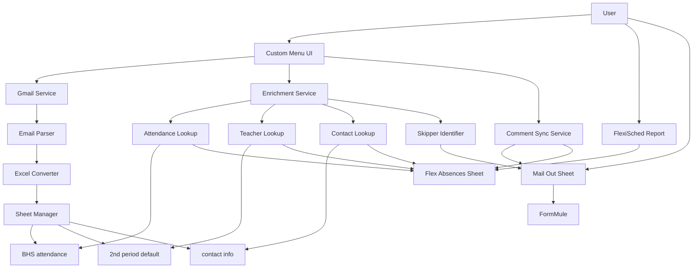

# Design Document

## Overview

This design document outlines the architecture and implementation approach for a Google Apps Script (GAS) automation system that identifies students who skipped their flex classes by comparing COGNOS attendance data with FlexiSched absence reports. The system consists of three main workflows:

1. **Manual Import Workflow**: Triggered by the user via a custom menu to retrieve three COGNOS reports ("My ATT - Attendance Bulletin (1)", "My Student CY List - Courses, Teacher & Room", and "My Student CY List - Student Email/Contact Info - Next Year Option (1)") from Gmail and import them into designated sheets (BHS attendance, 2nd period default, and contact info)
2. **Manual Enrichment Workflow**: Triggered by the user via a custom menu to enrich FlexiSched absence data with attendance codes, teacher names, and contact information, then identify skippers (students with #N/A attendance codes) and copy them to the Mail Out sheet
3. **Comment Sync Workflow**: Triggered by the user to copy comments from Mail Out sheet back to the Flex Absences sheet

The system is designed as a container-bound script attached to a Google Sheets spreadsheet, leveraging Gmail API access and Sheets API for data manipulation.

## Configuration

### Spreadsheet Structure

The bound Google Spreadsheet contains five sheets:

1. **[Date] flex absences** (e.g., "11.3 flex absences"): Contains FlexiSched absence data (columns A-K) and enriched data (columns L-Q)
2. **BHS attendance**: Contains COGNOS attendance data with absence codes in column K
3. **2nd period default**: Contains student 2nd period teacher assignments in column G
4. **contact info**: Contains student email (column M), Guardian 1 email (column F), Guardian 2 email (column J)
5. **Mail Out**: Contains only students who skipped (have #N/A attendance code) for FormMule processing

### COGNOS Report Mapping

| Report Email Subject | Target Sheet | Key Data | Special Processing |
|---------------------|--------------|----------|-------------------|
| My ATT - Attendance Bulletin (1) | BHS attendance | Column K: Attendance Code | Filter: Only rows where column J = "02" (2nd period) |
| My Student CY List - Courses, Teacher & Room | 2nd period default | Column G: Teacher Name | Reorder columns, exclude "9th Grd Entry" |
| My Student CY List - Student Email/Contact Info - Next Year Option (1) | contact info | Columns M, F, J: Emails | No special processing |

### Column Mappings

**My ATT - Attendance Bulletin (Original → BHS attendance)**:
- Filter: Only import rows where column J (Period) = "02"
- Import all columns as-is
- Attendance code is in column K

**My Student CY List - Courses, Teacher & Room (Original → 2nd period default)**:
- Original order: Student Name, Student Id, Grade, 9th Grd Entry, Period, Description, Room, Instructor, Instructor ID, Instructor Email
- Target order: Student Id, Student Name, Grade, Period, Description, Room, Instructor, Instructor Id, Instructor Email
- Exclude: 9th Grd Entry column

**My Student CY List - Student Email/Contact Info (Original → contact info)**:
- Import as-is
- Student email: Column M
- Guardian 1 email: Column F
- Guardian 2 email: Column J

## Architecture

### High-Level Component Diagram



### Component Responsibilities

1. **Gmail Service**: Searches and retrieves COGNOS report emails from the user's Gmail account
2. **Email Parser**: Extracts Excel attachments from Report Emails and validates report types
3. **Excel Converter**: Converts Excel (.xlsx) attachments to 2D arrays compatible with Google Sheets
4. **Sheet Manager**: Creates, updates, and manages the five sheets
5. **Custom Menu UI**: Provides user interface for manual operations (enrich data, sync comments)
6. **Enrichment Service**: Orchestrates the data enrichment process for FlexiSched absences
7. **Attendance Lookup**: Matches students to BHS attendance data and adds attendance codes or #N/A
8. **Teacher Lookup**: Matches students to 2nd period default data and adds teacher names
9. **Contact Lookup**: Matches students to contact info data and adds email addresses
10. **Skipper Identifier**: Identifies students with #N/A attendance codes and copies them to Mail Out sheet
11. **Comment Sync Service**: Copies comments from Mail Out sheet back to Flex Absences sheet

## Components and Interfaces

### 1. Gmail Service Module

**Purpose**: Interface with Gmail API to search and retrieve COGNOS report emails

**Key Functions**:
- `getUserEmail()`: Gets the active user's email address using `Session.getActiveUser().getEmail()`
- `searchCognosEmails()`: Searches for COGNOS emails from the user's own email address
- `getAttachments(messageId)`: Retrieves Excel attachments from a specific email
- `identifyReportType(email)`: Determines which of the three reports an email contains

**User Email Detection**:
- Uses `Session.getActiveUser().getEmail()` to automatically detect the user's email
- Searches Gmail with `from:` filter to only find emails from the user's own address
- No manual configuration required - works automatically for any user who opens the spreadsheet

**Configuration**:
```javascript
const EMAIL_CONFIG = {
  attendance: {
    subject: 'My ATT - Attendance Bulletin (1)',
    sheetName: 'BHS attendance',
    attendanceCodeColumn: 'K',  // Attendance code column
    periodColumn: 'J',           // Period column for filtering
    periodFilter: '02'           // Only import 2nd period rows
  },
  courses: {
    subject: 'My Student CY List - Courses, Teacher & Room',
    sheetName: '2nd period default',
    teacherColumn: 'G',  // Teacher name column (after reordering)
    originalColumns: ['Student Name', 'Student Id', 'Grade', '9th Grd Entry', 'Period', 'Description', 'Room', 'Instructor', 'Instructor ID', 'Instructor Email'],
    targetColumns: ['Student Id', 'Student Name', 'Grade', 'Period', 'Description', 'Room', 'Instructor', 'Instructor Id', 'Instructor Email']
  },
  contacts: {
    subject: 'My Student CY List - Student Email/Contact Info - Next Year Option (1)',
    sheetName: 'contact info',
    emailColumns: {
      student: 'M',
      guardian1: 'F',
      guardian2: 'J'
    }
  }
};
```

### 2. Excel Converter Module

**Purpose**: Convert Excel attachments to Google Sheets-compatible data structures

**Key Functions**:
- `convertExcelToArray(blob)`: Converts Excel blob to 2D array
- `parseExcelData(excelBlob)`: Extracts data and headers from Excel file
- `filterByPeriod(data, periodColumn, periodValue)`: Filters rows where specified column equals value (for 2nd period filtering)
- `reorderColumns(data, columnMapping)`: Reorders and excludes columns based on mapping (for courses report)

**Dependencies**: Uses Google Apps Script's built-in utilities for Excel (.xlsx) parsing

**File Format**: All COGNOS reports are in .xlsx (Excel 2007+) format

**Special Processing**:
- **Attendance Bulletin**: Filter rows where column J = "02" before importing
- **Courses Report**: Reorder columns and exclude "9th Grd Entry" before importing

### 3. Sheet Manager Module

**Purpose**: Manage all sheet operations including creation, updates, and data writing

**Key Functions**:
- `getOrCreateSheet(sheetName)`: Returns existing sheet or creates new one
- `getFlexAbsencesSheet()`: Finds sheet with date pattern and "flex absences" suffix
- `clearSheetData(sheet, startRow)`: Clears data from specified row onward
- `writeDataToSheet(sheet, data, startRow)`: Writes 2D array to sheet starting at row
- `addNoteToCell(sheet, cell, note)`: Adds a note to a specific cell
- `setSheetHeaders(sheet, headers)`: Sets up column headers

**Sheet Structure**:
- **BHS attendance**: COGNOS attendance data (2nd period only) with codes in column K
- **2nd period default**: COGNOS course data with teacher names in column G
- **contact info**: COGNOS contact data with emails in columns M, F, J
- **[Date] flex absences**: FlexiSched data (A-K) + enriched data (L-Q)
  - Columns A-K: FlexiSched absence data (user-entered)
  - Column L: Attendance code from BHS attendance (or #N/A)
  - Column M: 2nd period teacher from 2nd period default
  - Column N: Comments (user-entered after FormMule)
  - Columns O-Q: Student email, Guardian 1 email, Guardian 2 email
- **Mail Out**: Only students with #N/A in column L (columns A-Q)

### 4. Enrichment Service Module

**Purpose**: Enrich FlexiSched absence data with COGNOS data and identify skippers

**Key Functions**:
- `enrichFlexAbsences()`: Main orchestration function
- `getStudentIdColumn(sheet)`: Identifies which column contains the student ID
- `buildStudentMap(sheet, idColumn, dataColumns)`: Creates a map of student ID → data for fast lookup
- `addAttendanceCodes(flexSheet, attendanceMap)`: Adds attendance codes or #N/A to column L
- `addTeacherNames(flexSheet, teacherMap)`: Adds teacher names to column M
- `addContactInfo(flexSheet, contactMap)`: Adds emails to columns O-Q
- `identifySkippers(flexSheet)`: Finds rows with #N/A in column L
- `copySkippersToMailOut(flexSheet, skipperRows)`: Copies skipper data to Mail Out sheet

**Enrichment Logic**:
1. Read student IDs from Flex Absences Sheet (columns A-K)
2. Build lookup maps from BHS attendance, 2nd period default, and contact info sheets
3. For each student in Flex Absences Sheet:
   - Lookup attendance code in BHS attendance map → add to column L (or #N/A if not found)
   - Lookup teacher name in 2nd period default map → add to column M
   - Lookup emails in contact info map → add to columns O-Q
4. Identify all rows where column L = "#N/A"
5. Copy those rows (columns A-Q) to Mail Out sheet

### 5. Comment Sync Service Module

**Purpose**: Copy comments from Mail Out sheet back to Flex Absences sheet

**Key Functions**:
- `syncComments()`: Main orchestration function
- `buildCommentMap(mailOutSheet, idColumn)`: Creates map of student ID → comment
- `updateFlexComments(flexSheet, commentMap)`: Updates column N in Flex Absences Sheet

**Sync Logic**:
1. Read student IDs and comments (column N) from Mail Out sheet
2. Build map of student ID → comment
3. For each student in Flex Absences Sheet, lookup in comment map
4. If found, update column N with comment from Mail Out sheet

### 6. Sheet Creation Module

**Purpose**: Create new date-named flex absences sheets automatically

**Key Functions**:
- `createTodaysFlexAbsencesSheet()`: Creates a new sheet with today's date
- `formatDateForSheetName(date)`: Formats date as "M.D" (e.g., "11.3")
- `setupFlexAbsencesHeaders(sheet)`: Sets up column headers A-Q

**Sheet Creation Logic**:
1. Get today's date and format as "M.D flex absences"
2. Check if sheet with that name already exists
3. If exists, display message and do nothing
4. If not exists, create new sheet with that name
5. Set up column headers:
   - A-K: FlexiSched data headers (to be determined based on FlexiSched export format)
   - L: "Attendance Code"
   - M: "2nd Period Teacher"
   - N: "Comments"
   - O: "Student Email"
   - P: "Guardian 1 Email"
   - Q: "Guardian 2 Email"

### 7. UI Module

**Purpose**: Create custom menu and display user messages

**Key Functions**:
- `onOpen()`: Creates custom menu when spreadsheet opens
- `showSuccessMessage(message)`: Displays toast notification
- `showErrorMessage(message)`: Displays error alert

**Menu Structure**:
```
Flex Absence Tracker
├── Create today's flex absences sheet
├── Import COGNOS Reports from GMail
├── Add data to Flex Absences sheet
└── Sync Comments from Mail Out sheet
```

**Menu Actions**:
- **Create today's flex absences sheet**: Creates a new sheet with today's date in format "M.D flex absences" and sets up column headers
- **Import COGNOS Reports from GMail**: Automatically detects user's email and searches their Gmail for the three COGNOS reports, then imports them to their respective sheets
- **Add data to Flex Absences sheet**: Enriches FlexiSched data with attendance codes, teacher names, and contact info, then identifies skippers
- **Sync Comments from Mail Out sheet**: Copies comments from Mail Out sheet back to Flex Absences sheet

## Data Models

### Email Search Result
```javascript
{
  messageId: string,
  subject: string,
  from: string,
  date: Date,
  reportType: 'attendance' | 'courses' | 'contacts'
}
```

### Excel Attachment
```javascript
{
  blob: Blob,
  filename: string,
  mimeType: 'application/vnd.openxmlformats-officedocument.spreadsheetml.sheet'  // .xlsx format
}
```

### Sheet Data Structure
```javascript
{
  headers: string[],
  rows: any[][]
}
```

### Student Lookup Map
```javascript
Map<string, {
  attendanceCode?: string,
  teacherName?: string,
  studentEmail?: string,
  guardian1Email?: string,
  guardian2Email?: string,
  rowIndex?: number
}>
```

### Skipper Record
```javascript
{
  rowIndex: number,
  studentId: string,
  rowData: any[]  // Columns A-Q
}
```

## Error Handling

### Error Categories

1. **Gmail Access Errors**
   - Missing authorization
   - No emails found
   - Attachment retrieval failure

2. **Data Processing Errors**
   - Invalid Excel format
   - Missing required columns
   - Data conversion failures

3. **Sheet Operation Errors**
   - Sheet not found
   - Permission issues
   - Invalid data range

### Error Handling Strategy

**Automated Import Errors**:
- Log to Apps Script execution log
- Display notification to user with error status
- Add error note to cell A1 of affected sheet
- Continue processing other reports if possible

**Manual Enrichment Errors**:
- Display user-friendly error dialog
- Log detailed error to execution log
- Preserve existing data in Flex Absences Sheet

**Comment Sync Errors**:
- Display warning for unmatched students
- Log detailed error to execution log
- Continue processing other students

**Error Message Format**:
```javascript
{
  timestamp: Date,
  operation: string,
  errorType: string,
  message: string,
  details: object
}
```

## Testing Strategy

### Unit Testing Approach

**Testable Components**:
1. Email search query construction for three specific COGNOS reports
2. Excel to array conversion
3. Student ID matching logic across sheets
4. Attendance code lookup (including #N/A for missing)
5. Skipper identification logic
6. Comment sync matching

**Test Data**:
- Mock Gmail messages with three COGNOS report attachments
- Sample Excel files with known student data
- Test spreadsheet with:
  - FlexiSched data in Flex Absences Sheet
  - COGNOS data in BHS attendance, 2nd period default, contact info
  - Mix of students with and without attendance codes

### Integration Testing

**Test Scenarios**:
1. **Happy Path**: All three reports found and imported successfully, enrichment identifies skippers correctly
2. **Missing Report**: Only 2 of 3 reports available
3. **Duplicate Emails**: Multiple emails match search criteria
4. **Invalid Excel**: Attachment is not a valid Excel file
5. **All Students Have Codes**: No skippers identified (Mail Out sheet empty)
6. **All Students Skip**: All FlexiSched students have #N/A (all copied to Mail Out)
7. **Partial Match**: Some students in FlexiSched not in COGNOS data
8. **Empty FlexiSched Data**: Enrichment before user pastes data
9. **Comment Sync**: Comments correctly copied from Mail Out to Flex Absences
10. **Date-Named Sheet**: Correctly identifies sheet with date pattern

### Manual Testing Checklist

- [ ] Manual import retrieves all three reports from Gmail
- [ ] All three reports imported to correct sheets (BHS attendance, 2nd period default, contact info)
- [ ] Timestamp notes appear in A1 cells
- [ ] Custom menu appears on spreadsheet open with correct items
- [ ] Enrichment adds attendance codes to column L (or #N/A)
- [ ] Enrichment adds teacher names to column M
- [ ] Enrichment adds emails to columns O-Q
- [ ] Skippers (with #N/A) correctly copied to Mail Out sheet
- [ ] FlexiSched data (A-K) preserved during enrichment
- [ ] Comment sync copies comments from Mail Out column N to Flex Absences column N
- [ ] Date-named sheet correctly identified
- [ ] Error messages display correctly
- [ ] Execution logs contain appropriate detail

## Configuration and Setup

### Initial Setup Steps

1. Create Google Sheets spreadsheet with five sheets: [Date] flex absences, BHS attendance, 2nd period default, contact info, Mail Out
2. Bind Apps Script project to spreadsheet
3. Configure EMAIL_CONFIG with actual COGNOS email patterns
4. Define sheet names and column mappings
5. Grant necessary Gmail and Sheets permissions
6. Test manual import from custom menu

### Configuration Constants

```javascript
const CONFIG = {
  // Email search configuration
  emailConfig: EMAIL_CONFIG,
  
  // Sheet names
  sheetNames: {
    attendance: 'BHS attendance',
    courses: '2nd period default',
    contacts: 'contact info',
    mailOut: 'Mail Out',
    flexAbsencesPattern: /\d+\.\d+\s+flex absences/i  // Matches "11.3 flex absences"
  },
  
  // Column mappings for enrichment
  columnMappings: {
    flexAbsences: {
      flexiSchedData: 'A:K',      // User-pasted FlexiSched data
      attendanceCode: 'L',         // From BHS attendance or #N/A
      teacherName: 'M',            // From 2nd period default
      comments: 'N',               // User-entered after FormMule
      studentEmail: 'O',           // From contact info
      guardian1Email: 'P',         // From contact info
      guardian2Email: 'Q'          // From contact info
    },
    bhsAttendance: {
      attendanceCode: 'K'  // Attendance code is in column K
    },
    secondPeriod: {
      teacherName: 'G'
    },
    contactInfo: {
      studentEmail: 'M',
      guardian1Email: 'F',
      guardian2Email: 'J'
    }
  },
  
  // Student ID column (assumed to be column A in all sheets)
  studentIdColumn: 'A'
};
```

### Permission Requirements

- **Gmail**: Read access to user's Gmail account
- **Sheets**: Full access to bound spreadsheet

## Performance Considerations

### Optimization Strategies

1. **Batch Operations**: Use `setValues()` instead of individual cell updates
2. **Caching**: Cache sheet references and ID maps during consolidation
3. **Lazy Loading**: Only load sheet data when needed for enrichment
4. **Query Optimization**: Use specific Gmail search queries to minimize results

### Execution Time Limits

- Google Apps Script has 6-minute execution limit for manual executions
- Expected execution time: 30-90 seconds for typical data volumes
- If timeout occurs, implement chunking strategy for large datasets

## Security Considerations

1. **OAuth Scopes**: Request minimum necessary permissions
2. **Data Privacy**: COGNOS reports may contain sensitive student/parent data
3. **Access Control**: Spreadsheet sharing settings control who can trigger consolidation
4. **Audit Trail**: All operations logged with timestamps

## Workflow Summary

### Daily Workflow

1. **11:30 AM**: COGNOS generates and emails three reports to user:
   - "My ATT - Attendance Bulletin (1)"
   - "My Student CY List - Courses, Teacher & Room"
   - "My Student CY List - Student Email/Contact Info - Next Year Option (1)"
2. **User Action**: User clicks "Create today's flex absences sheet" menu item
   - GAS creates a new sheet with today's date in format "M.D flex absences" (e.g., "11.3 flex absences")
   - GAS sets up column headers A-Q
3. **User Action**: User clicks "Import COGNOS Reports from GMail" menu item to import reports to BHS attendance, 2nd period default, and contact info sheets
   - GAS automatically detects user's email address using `Session.getActiveUser().getEmail()`
   - GAS searches only the user's own Gmail for the three COGNOS reports
4. **User Action**: User copies FlexiSched absence data and pastes into [Date] flex absences sheet (columns A-K)
5. **User Action**: User clicks "Add data to Flex Absences sheet" menu item
   - GAS adds attendance codes to column L (#N/A if not found)
   - GAS adds teacher names to column M
   - GAS adds emails to columns O-Q
   - GAS copies students with #N/A to Mail Out sheet
6. **User Action**: User runs FormMule to email guardians from Mail Out sheet
7. **User Action**: User adds comments in column N of Mail Out sheet
8. **User Action**: User clicks "Sync Comments from Mail Out sheet" menu item
   - GAS copies comments from Mail Out column N to Flex Absences column N

### Key Business Logic

**Skipper Identification**: A student is considered a "skipper" if:
- They appear in the FlexiSched absence data (pasted into Flex Absences sheet)
- AND they do NOT have a matching attendance code in the BHS attendance sheet (indicated by #N/A in column L)

This logic differentiates between students with legitimate absences (have COGNOS attendance codes) and students who skipped their flex class (no COGNOS attendance code).

## Future Enhancements

1. **Data Validation**: Validate imported data against expected schemas
2. **Historical Archive**: Keep previous day's data in archive sheets
3. **Error Recovery**: Automatic retry logic for transient failures
4. **Configuration UI**: Properties dialog for updating EMAIL_CONFIG without code changes
5. **Automatic Date Sheet Creation**: Create new date-named flex absences sheet automatically each day
